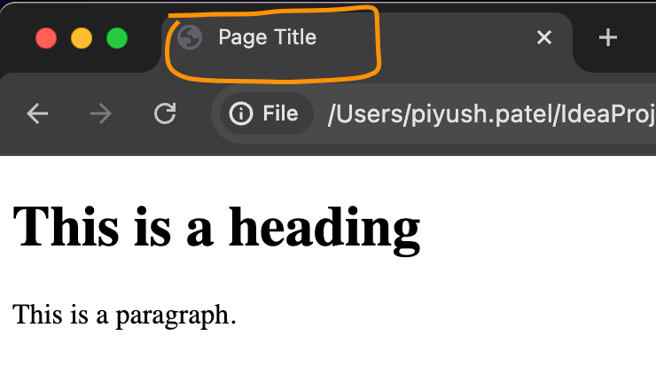

# HTML Title Tag

`<title>` tag is used to define the title of an HTML document. All HTML documents should have a page **title**. This helps with search engine ranking and provides a title for the browser tab. You may not notice it because it's part of `head` section of the HTML document. This is usually not visible to the user unless they look at the browser tab or bookmark the page.

HTML document title is defined as follows:

```html
<!DOCTYPE html>
<html>
<head>
    <title>Page Title</title>
</head>
<body>
    <h1>This is a heading</h1>
    <p>This is a paragraph.</p>
</body>
</html>
```

As you can see, the HTML `html` tag contains two sections: a `head` tag and a `body` tag. The `head` tag contains a `title` tag. The `title` tag can only be used inside `head` element of the HTML page. The content inside the `title` tag is displayed in the browser tab. 



If you bookmark this page, the title will be used as the bookmark name. Try bookmarking this page to see the title in action on your bookmark (surprise!!!).